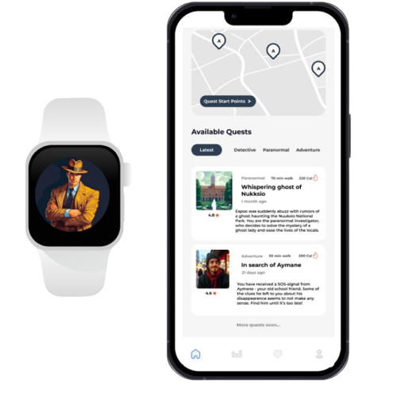
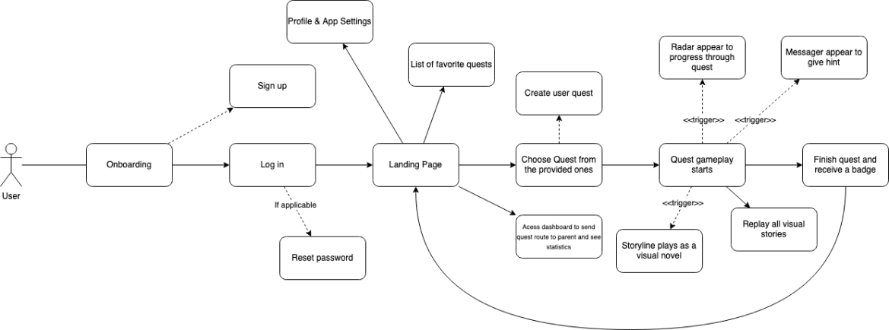
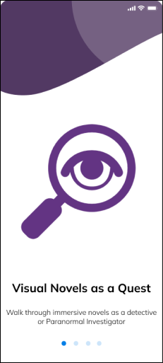
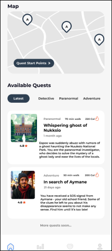
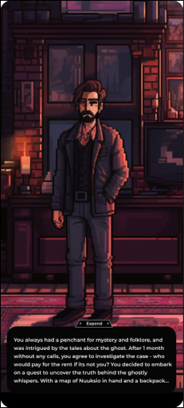

# Kinetic Quests: Adventures in Motion

### ”A quest a day keeps the doctor away!”

## Overview

A visual story-telling app that makes the user progress through the story by the steps he went by. The stories are short, can be completed within 1-2 hours, and require a minimum of 5000 steps to unlock all parts of the story. Detective stories with suspense generate engagement from the user and ensure that he finishes the story.

There are several triggers that reveal map pieces or clues to where to go next. Those triggers are:

- Step count - pedometer (Step counter) Completing the step count reveals a map piece or a clue.
- Getting near distinct location - (GNSS receiver) Real-world location corresponds to different zones in the virtual jungle. Getting near the location will either reveal some new piece of information, unlock a new place to go, or trigger chat with NPCs that will help you. (Proximity detection maybe)
- Playing at different times of the day changes the story - (Temperature Sensor and Ambient Light Sensor): The game advises playing at different times of the day or in different weather conditions for special in-game events. Task: Play during suitable outdoor conditions.
- Proximity radar - sometimes the map turns off and you have a radar that beeps more frequently when you are near the needed location. Wearable devices will beep or vibrate with the same rules.
- Heart BPM changes some parts of stories
- Audio clues when playing in headphones

## Stacks

### Mobile application development framework:

React Native

### Cloud storage:

Firebase

### Location based services: 

Google Maps API

## How does it work

  

1. Create an Account:
- Begin by creating a personalized account within the app.
- Give access to health data collected by owned devices (phone, smart watch,..).
2. Choose a Quest:
- Select a thrilling quest from our collection.
3. Get Oriented:
- Receive an engaging story introduction along with directions to the quest's starting point.
4. Navigate the Adventure:
- Once you reach the starting point, enjoy real-time hints and directions to guide you to the next key location.
5. Proximity-Based Experience:
- As you approach each mark, the app transitions to a proximity-based mode.
- Rely on proximity beeping and subtle hints, with the beeping intensity increasing as you get closer.
6. Unlock the Next Chapter:
- Upon reaching the exact location and meeting step requirements, unlock the next chapter of the story.
7. Adaptive Storytelling:
- AI dynamically adapts the narrative based on your heart rate.
- Experience personalized storytelling that syncs with your emotional rhythm, ensuring an engaging and tailored adventure every step of the way.
8. Explore and Unlock:
- Finish quests to unlock new stories and broaden your adventure options.
9. Track Your Journey:
- Keep tabs on your progress through a dedicated dashboard.
- Gain valuable health insights based on your questing activity.

  
  
  

## Demo

[https://youtu.be/ukcClqNUTPE](https://youtu.be/ukcClqNUTPE).

## The team

- Aymane Ghanam [aymaneghanam123@gmail.com](aymaneghanam123@gmail.com)
- Dias Baimukhanov [dias.baimukhanov@nu.edu.kz](mailto:dias.baimukhanov@nu.edu.kz)
- Victoriia Shubina [viktoriia.shu@gmail.com](mailto:viktoriia.shu@gmail.com)
- Driouech Afaf [afaf.driouech@gmail.com](mailto:afaf.driouech@gmail.com)

**Junction 2023 · Team NoFunNoGain**
